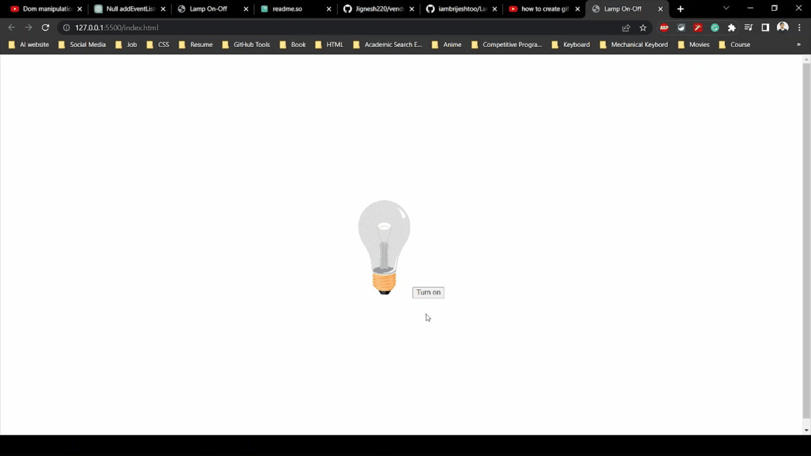

# Lamp On - Off

This is simple project created using DOM manipulation which use events to control the lamp status on and off.

## Acknowledgements

- [Coder's Gyan](https://youtu.be/4sQaUNDZq3w)

## Tech Stack

- HTML
- CSS
- JavaScript

## Screenshot

